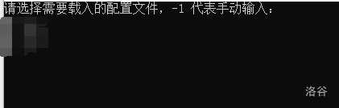
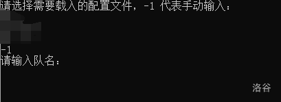
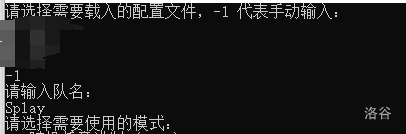

# Chapter 2 测号技术

> 要在对战中取胜，关键是要找到一个足够强大的名字。

## 2.1 衡量名字/战组的强弱

- 前面已经介绍过官方给出的四种评分。由于你在实战中遭遇的名字通常会较强，所以**通常来说**强评对名字的组队实力更有参考价值，强单对名字的单挑实力更有参考价值。

- 建议把评分测试至 100%，10% 测出来的评分误差较大，并且在大多数时候会比 100% 偏高。如果觉得测试一个 100% 所需时间过久，后面有相关工具的介绍。

- 由于天卫和普通名字差别很大，强单高不一定说明进行玩家之间战斗时的实战强，比如一个强单 7000+ 的净化号（例如 `十六夜咲夜 GD5VLRTL@Squall`）**可能**强度还不如强单 6500 的一些其他类型的号。对实战来说更有用的还是打其他较强的普通名字（指别的玩家的强号）的胜率。

- 通常来说，一个名字对另一个名字 60% 的胜率即可视为较高的胜率。但是 打单个强号的胜率高并不能说明号的强度，因为各类型的号之间存在克制关系，比如强幻术也可能打不过弱背刺。下面的三个名字之间的胜率就由于克制而形成了“石头剪刀布”的关系：

```text
光YLqYQFwdtfCUl6J@Squall
U>7D3Ol7uWKIfTC@XJ联队
江DuDSKcYnD3nB@Squall
```

- 多人组也是同样的道理，评分高并不意味着打其他队的多人组就更强。我们提供了超强单、超强评的脚本方便玩家测试一些对主流玩家的单挑号/多人组的胜率分布和平均胜率（详见2.4）。**这是目前衡量一个号的单挑能力或一个多人组的实战能力的主要方式！**

## 2.2 测号技术发展史

### 手测时代

**基于原理：八围高于 652 的号在小于等于 10 人的战斗中，在显示属性后会在末尾显示一个表情。**

由于名字竞技场官方教程中有类似“比较强的号通常会在最后有一个表情”的表述，我们可以每次枚举十个名字，查看有没有表情，取有表情的号测评分，评分高的保留。

每次输入十个号的格式可以由自己人为决定。通常会使用上十个号和这十个号改动所需要的操作较少且较为固定的格式，以提升速度。用快捷键 `Alt+1` 和 `Alt+2` 也能提升速度。

由于当时分身技能的数值设定有些不合理，导致存在一些八围不高（可能没有表情）但是分身概率/频率高，因此评分高实力强的号。在这类号被发掘出来后，手测可以加上一个步骤，在输入完名字开始战斗后按快进键，假如发现一个名字在战斗中分身了很多，那么也可以去测试评分。最著名的号应当为 `sinα=-0.056@SG`，当时评分为 7724，而第二名的评分不到 7300。很多这样测出来的强号都可以单挑一些被分身克制的 boss（比如蚊、尤里、史莱姆等）。

在作者调整平衡性将分身削弱后不再有快进测号的步骤。

速度：约几千到一万多每小时。

### 按键精灵时代

**基于原理：将手测的过程使用按键精灵模拟。**

手测找有表情的号的过程比较固定，因此用第三方软件【按键精灵】模拟这一动作，解放双手实现自动化，并且可以优化手部动作速度的瓶颈。

相比于朴素手测劣势在于找分身号的过程比较难以量化，因此不太能用于寻找分身号。但是在作者调整平衡性将分身削弱后这个劣势不再存在。

速度：几万到二十几万每天。

### 官测时代

**基于原理：作者更新了 `!test!` 寻找有表情的号的功能。**

按键精灵时代后期，玩家【滑稽】的速度已经达到了二十万每天以上，和其他人拉开差距，产生了一定的技术鸿沟。在这种背景下，作者更新了 `!test!` 能帮你寻找有表情的号的功能。  

单开的速度并不算很快（作者确实表明压过速度）。但相比于按键精灵，可以开多个浏览器同时测，速度可以有所提升。

但是仍然不能挂机，这是相比于完整成熟按键精灵工具链的劣势。

速度：几十万每天。

### 脚本文测时代

**基于原理：官测以及 javascript 脚本。**

由玩家【文哥】发明，故称为文测。原理是结合官测，使用 javascript 脚本，当一组号测完后将捕捉到的三级表情输出在 console 里，然后进行下一组测号。

实现了抓取三表的自动化，但评分仍然需要手动操作。

速度：几百万每天。

### 一体机文测时代

**基于原理：文测。**

由玩家【文哥】在原来的脚本文测上改进。使用了合适的 UI，使得测号操作更加亲民化和方便化。后期增加了将抓取到的三表测评分 10% 并且高于一定阈值才输出来的功能。

省去了初步开箱的麻烦，但某种意义上也是失去了初步开箱的乐趣。

速度：几百万到近千万每天。

### 量子波动时代

**基于原理：手测和 javascript。**

由玩家【贩钻石剑】提出、发明，由玩家【文哥】、【Hell】等人完善。

这个技术被称为量子波动的原因已难以考证，合理猜测是这个技术使用的时候屏幕会一直在闪，很像叠加态和不确定性。

不再基于官测，而是将手测的过程换成用 javascript 脚本实现，比按键精灵快很多，也比官方测号器快不少。同时也能测 10% 评分并输出高于一定阈值的号。

后期通过一些方式节省了部分渲染的时间（将捕获三表的方式改为接受输出三表的信号而不是寻找三表的图片），让速度变得更快。该技术被称为量子波动-β。

速度：几千万每天。

### 过渡阶段

**基于原理：名竞源代码反混淆的部分破译。**

如何将量子波动技术变得更快？在部分破译名竞源代码的基础上，可以将代码进行适当改动来提升速度。一些可能得方法包括将输入小于等于 10 个号才会显示表情改成小于等于 8000，或者大幅削减名竞的渲染等。

速度：几千万到几十亿每天。

注意：该阶段的测号器均为内部测试时使用，并没有流出。

### 核测号器时代

**基于原理：号的属性计算方式被找到。**

玩家【powerless】对名字竞技场原本代码进行了部分反混淆，并找到了计算号的属性部分的代码。由于原本算号是用网页代码写的，速度较慢。改用 c++ 之类的速度较快的语言重写，且彻底抛弃了渲染等其他的框架后，速度大幅提升。

值得一提的是，玩家【文哥】、【滑稽】等人在先前就已经研制了类似的技术，只不过因为代码实现原因常数较大速度略慢；但没有公开。

后来玩家【powerless】、【曙光】等人对原始代码进行进一步卡常，形成的测号器被称为【早期 pbb 测号器】。

后来根据 【powerless】 找到的算号核心代码，玩家可以根据自己的需求自己编写测号器。比较出名的是【pl 测号器】（由 【powerless】 发明）和【pbb 测号器】（主要由玩家【曙光】依据【早期 pbb 测号器】发明，【昀澤】等人进行改写）。

速度：几千亿到几万亿每天。

### GPU 测号

经过贴吧投票一致通过，该技术被封存。

## 2.3 pl 测号器使用方法

目前 pl 测号器的封装程度较高，只需要玩家动手设置较少参数即可。

测号器文件可于 QQ 群内下载, 或者在 [实际上不存在的链接](不存在!) 下载

pl 可测号的格式为前缀（可选）+变化字符+后缀（可选）+@队名。

**使用前提醒：请关闭电脑的所有杀毒系统，或将 main.exe 加入它们的白名单。**

### 首次测号

打开 main.exe 后，会见到如下场景。



首次使用测号器时，并无任何配置文件（上图打码部分为已有的配置文件，可以忽略），所以此时应**输入** `-1`，手动配置文件。



输入 `-1` 后，会出现如上场景，此时应**输入你自己的战队名**。



如上图，接下来会出现两种测号模式。

### 输入 0：随机模式

1. **输入你想要测的测号量**（可以参考下一章”测号单位制“）；
2. **输入前缀**；

**输入** `+` 即为无前缀。

注意 pl 并不会自动在前缀后加上空格，如果需要请自己输入。

3. **输入后缀**；

**输入** `+` 即为无后缀。

注意 pl 也并不会在后缀前自动加上空格，如果需要请自己输入。

4. **输入可变部分长度**；
5. **输入字符集**；

注意不要输入 `+`、`@`。

尽量不要输入 `?`，因为这有可能使你的名字出现 `???` 从而导致无法评分。

6. **输入八围阈值**（低于该阈值的号将被忽略，理论上设置得高运行速度越快，但会显著增加漏掉低八维强号的概率，**推荐阈值为 $652$**）；

7. 选择**虚评**作为筛号规则（虚评的详细介绍将在下一章给出）；

8. **输入虚评阈值**（推荐阈值为 $4700\sim 5100$）；

注意 pl 内置的虚评是旧版，对幻术号的评分尤为不准确，所以建议用新虚评重新筛选一遍。

9. **输入** `-2`，结束配置；
10. 如要保存，**输入配置文件名**；如不保存，**输入** `.`

### 输入 1：顺序模式

1. **输入测号区间**

  注意区间为**左闭右开**。
  
  ```text
  e.g.
  假设号量共为 100000000000。
  则单开测号器中区间应填 0 100000000000；
  双开测号器中区间应分别填 0 50000000000 与 50000000000 100000000000。
  以此类推。
  注意到电脑如分大小核，大小核之间测号速度会有较大差异，可根据实际情况填写区间。
  ```

2. **输入前缀**；
3. **输入后缀**；
4. **输入可变部分长度**；
5. **输入字符集**；
6. **输入八围阈值**；
7. 选择**虚评**作为筛号规则；
8. **输入虚评阈值**；
9. **输入** `-2`，结束配置；
10. 如要保存，**输入配置文件名**；如不保存，**输入** `.`；

注意配置文件将保存在 `configs` 文件夹中。

11. 完成以上步骤后，电脑将开始自动测号。

注意输出文件将保存在 `out` 文件夹中。

注意使电脑一直处于开机状态，否则窗口将会被关闭。（视电脑情况决定，晚上一直开着测号器，有可能会缩短电脑寿命，或有小概率发生危险，请自己权衡）

## 2.4 开箱器与超强评/超强单脚本

将待测号进行测评分数的行为（10% 或 100%）的行为，由于其很像游戏中的开宝箱，需要运气，并且在出强号时有惊喜的感觉，因此称为“开箱”。

### 开箱技术发展史

最初的开箱技术为手开，将出现的有表情的号一个一个复制到名竞网站中进行 `!test!`。

后来通过 javascript 脚本，实现了自动化，可以进行挂机开箱，并且可以打开多个浏览器同时开箱，但速度无显著提升。

再后来通过改写名竞网站的源代码，可以将一些不必要的空闲时间利用起来提升速度。  
下面是一些使用这些技术的网站，测评分方法和 <https://deepmess.com/namerena/> 相同（`!test!`）。  
大部分网站是只能测特定的精度的分数：  
1%：<https://tinman00.github.io/1/namerena/>  
10%：<https://tinman00.github.io/10/namerena/>  
100%：<https://tinman00.github.io/100/namerena/>  
2%：<https://namerena.pages.dev/faster>  
5%：<https://namerena.pages.dev/fast0>  
10%：<https://namerena.pages.dev/fast1>  
25%：<https://namerena.pages.dev/fastqt>  
100%：<https://namerena.pages.dev/fast2>  
10的幂次（和官方网站相同，可以一直往下测）：<https://fast-namerena.pages.dev/>

这些网站上同样可以使用 javascript 脚本。

下面是一份脚本，开头的几个参数可以根据注释自行修改。  
使用方法：将号复制进名竞的输入框（每行一个），按下 `F12` 键（这是电脑上的一个键，不是三个键！），将脚本复制进去，按回车键。注意相应精度需要对应的网站，否则可能会出现测得很慢浪费大量时间或者直接卡死的情况。

<details>
<summary>点击展开代码</summary>

```javascript
const all = document.querySelector('#textdiv>textarea').value.split('\n');
let type = 3; //1:pp 2:qp 3:qd 4:pd
let suffix=""; //后缀，比如说你想固定几个人枚举一个人配多人的时候用
let acc=10; //10% or 100%
let chktime=50; //每隔多少 ms chk 一次，建议测 10% 的时候设 50，100% 的时候设 300
let outputmin=6000; //输出的最低阈值
let totnum=1; //你测试的几人组（单个人的 qp qd pp 等都是 1）
let j = 0;
let fi = 0;
let result = "";
let cur="";
let avg=0;
let cnt=0;
function check() {
 if (fi) {
   return;
 }
 if (cw().document.querySelectorAll('span.u').length <= acc) {
   setTimeout(() => {
     check();
   }, chktime);
   return;
 }
 const progress = cw().document.querySelectorAll('span.u');
 let pos = -1;
 for (let i = acc; i < progress.length; i++) {
   const element = progress[i];
   if (element.textContent.split[' '](0) === '》') {
     pos = i;
     break;
   }
 }
 if (pos == -1) {
   setTimeout(() => {
     check();
   }, chktime);
   return;
 }
 const val = progress[pos].textContent.split[' '](2);
 if (cur != cw().document.querySelectorAll['div.name'](totnum).textContent+cw().document.querySelectorAll['div.name'](totnum+1).textContent)
 {
    let score=parseInt(val);
    if (score>=outputmin) result+=(`${all[j]} ${val}`)+"\n";
   cnt+=1;
   j++;
   cur = cw().document.querySelectorAll['div.name'](totnum).textContent+cw().document.querySelectorAll['div.name'](totnum+1).textContent;
   document.querySelector('textarea#result').value = result;
   reload();
 }
 setTimeout(() => {
   check();
 }, chktime);
}
function reload() {
 if (j < all.length)
 {
    let inputvalue="!test!\n";
    name=all[j]+suffix;
    if (type==1) inputvalue+="\n\n"+name;
    if (type==2) inputvalue+="!\n\n"+name;
    if (type==3) inputvalue+="!\n\n"+name+'\n'+name;
    if (type==4) inputvalue+="\n\n"+name+"\n"+name;
   document.querySelector('#textdiv>textarea').value =inputvalue;
   document.querySelector('.goBtn').click();
 } else {
   fi = 1;
 }
}
const NW = document.createElement('textarea');
NW.id = 'result';
document.body.appendChild(NW);
NW.setAttribute('readonly', true);
document.getElementsByClassName['mdframe'](0).setAttribute('style',
   'display:none;');
reload();
check();
```

</details>

### 提升箱子的质量

很多时候箱子会过于多，而消耗大量的开箱时间。在核测号器刚出现的时候，仅仅以是否是三表作为开箱标准的话，开箱时间会远超过测号时间。因此，提升箱子质量的方法应运而生。目前主要有曙光筛和虚评两种策略。

#### 曙光筛

由于 pl 测号器可以得知不仅号的八围属性，还可以得知技能的熟练度，便可以根据技能进行一波筛选。  
比如八围不是很高而且技能总熟练度不是很高的可以排除掉，背刺熟练度高但是攻高防低的可以排除掉等。虽然这里举的例子是做减法，但实际的曙光筛是做加法，可以排除掉相当大一部分的大概率没用的号。  

但是旧版曙光筛随着时代进步逐渐不那么准确或有用。后来推出了新版的曙光筛，但是是配合虚评（见下）使用的，通过的标准降低了很多。

注意：在使用 pl 测号器时不要使用曙光筛这一策略组！！！因为 pl 把曙光筛.dll 写挂了，可能导致无法运行！！！如果想使用曙光筛，请使用 pbb 测号器。

#### 虚评

由于测评分需要打千乃至万次对战，但是号的属性就只有那些，号的实力应该只和这些属性有关。因此想到利用这些数值进行评分的拟合。称为“虚评”。  

虚评的大致原理是根据八围和熟练度这些属性的值和两两乘积（考虑到技能和属性之间的配合）总共近 1000 个参数进行线性拟合。除此之外还考虑了幻术号召唤出来的幻影属性，隐匿是否是 0 列为单独参数等。

在群文件里可以下载虚评相关代码。打开 `index.html` 便可以测虚评，第一个数值是强评拟合值（称为虚评），第二个数值是强单拟合值（称为虚单）。通过自己修改 `main.js` 代码可以增设阈值和技能提醒等。

值得注意的是，由于虚评和虚单的训练集都是比较强的常规名字，因此如果用虚评评测离训练集差距较大的名字可能会出现离谱的数值。

通过对号的虚评设阈值再开箱，可以大幅减少开箱的量。

虚评文件可在 qq 群里, 或者在 [这里下载](./XP1015.zip)

### 超强单与超强评

通过强评和强单，我们可以大致知道一个号的组队能力和单挑能力。但是值得注意的是这是对天卫的组队水平和单挑水平，和实际与大部分玩家对战的情况并不一样。因此我们可以通过收集主流玩家的单挑号或者多人组作为“靶子”，测对这些号/多人组的胜率的平均值，来获得更合理的实战水平评估。

靶子的链接（长期更新）：<https://www.luogu.com/paste/0lx16qoq>。如果你无法打开网站或者没有账号（注：要是本来就没有账号那么不建议注册），你可以点击[这里](./cqd.md)获得一个副本（不一定是最新版）。最下方的脚本可以像开箱那样测多个号/多人组的超强单/超强评。使用方法：在输入框内一行一个号/多人组，多人组每个号之间用一个单独的`+`字符连接。

### 2.5 测号单位制与出号率

基于当前主流的测号速度，我们选择 **T($10^{12}$)** 作为测号量的计量单位。

请注意，1T 在中文中的表述是 **一万亿**，而非一千亿。

根据玩家群体的经验，期望下出一个强评（强化组队评分）6000 的号需要略低于 $0.5T$ 的测号量，而该评分每增加 100，期望测号量便会翻三倍，这被称为 **三倍定律**。可以利用三倍定律大致预估测出某个强度的号所需要的时间。

对于尖端评分（如 6400 以上），由于数据过少，不能大致确定期望测号量的增加速度，但应该在三倍以上。

请注意：出不出得了尖端号始终是取决于运气的事情，名竞也不具有一般抽卡游戏的“保底”特性，因此这些期望值始终仅能供你参考。
